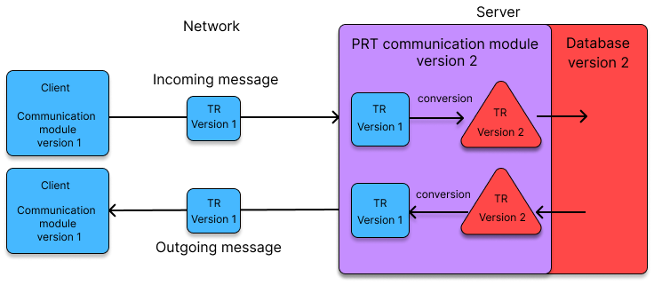
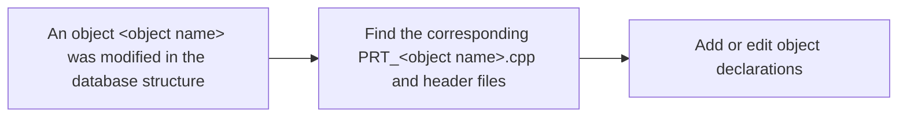
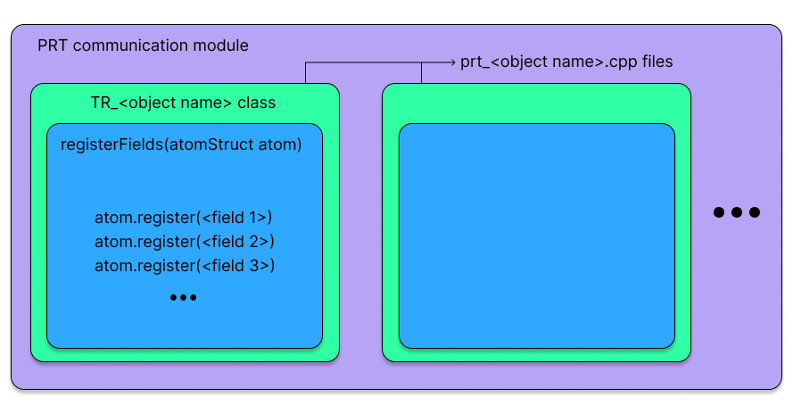
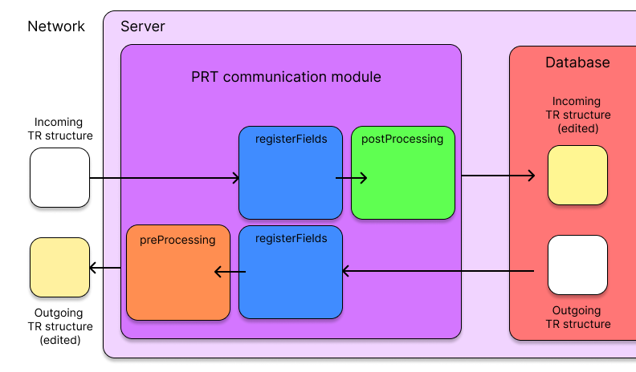

> :uk: **About this sample**  
This is part of a series of how-to guides that I made for various tasks that were common for my team, essential for development, yet were lacking any documentation. This module in particular makes heavy use of templating and is difficult to fully understand even for experienced developers. Very few developers (3 at most) know how to properly make changes in it, yet it was left entirely undocumented for at least 20 years. Even if I didn't fully know the underlying logic, I decided to make this guide first to get a reference for myself and then as a way to limit the risk of the company completely losing this knowledge. Another goal was to help the onboarding of possible new developers in the team.   
This guide assumes basic knowledge of C structures and of our database structures.  
**To avoid any potential issue with proprietary code, I replaced all internal logic and names by a mock framework**.


> :fr: **À propos de cet exemple**  
Ce document fait partie d'une série de guides pratiques que j'ai rédigés pour diverses tâches courantes au sein de mon équipe, essentielles au développement, mais dépourvues de documentation. Ce module en particulier utilise intensivement le templating et est difficile à comprendre en détail même pour des développeurs expérimentés. Très peu de développeurs (3 au maximum) savent comment y apporter correctement des modifications, mais il est pourtant resté entièrement non documenté pendant au moins 20 ans. Même si je n'en maîtrisais pas entièrement la logique interne, j'ai décidé de rédiger ce guide d'abord pour m'en servir de référence, mais aussi pour limiter le risque que l'entreprise perde complètement ces connaissances. Un autre objectif était de faciliter l'intégration de nouveaux développeurs dans l'équipe.
Ce guide suppose une connaissance de base des structures en C et de nos structures de base de données.  
**Pour éviter tout problème potentiel lié à la confidentialité du code, j'ai remplacé toute la logique interne et les noms par un framework factice.**

---

# Summary
- [What this guide is for](#What-this-guide-is-for)
- [Introduction to the PRT communication module](#Introduction-to-the-PRT-communication-module)
- [Adding or editing communication module declarations](#Adding-or-editing-communication-module-declarations)
	- [Structure of the PRT module files](#Structure-of-the-PRT-module-files)
	- [Basic syntax for registering a field](#Basic-syntax-for-registering-a-field)
		- [First parameter : name](#First-parameter-name)
		- [Second parameter : PRT type descriptor](#-Second-parameter-PRT-type-descriptor)
		- [Third parameter : position accessor](#-Third-parameter-position-accessor)
		- [Fourth parameter : RegisterInfo](#Fourth-parameter-RegisterInfo)
	- [Complete declaration sample](#Complete-declaration-sample)
- [Compatibility management](#Compatibility-management)
	- [Setting a value aside](#Setting-a-value-aside)
	- [Pre-processing and post-processing](#Pre-processing-and-post-processing)
- [Checking the validity of changes](#Checking-the-validity-of-changes)

# What this guide is for
This document will give you the basic understanding and the tools necessary to safely make changes in the PRT communication module when required.

If you're already familiar with this module, use the following list as a quick reminder of the process:
1. Locate the file `PRT_<name>.cpp/h` relevant to the object modified in the `PAtoms` database.
2. Find the `Tr_<name>::registerFields` function.
3. Edit or add a call to a `register` function in the `AtomStruct` for the correct field.
4. Add the versioning information (and transfer mask if needed) to the `RegisterInfo` parameter.
5. Manage compatibility in `preProcessing` and `postProcessing` as needed.
6. When using `LOCAL_VAR`, make sure allocated memory is correctly deallocated in the `Tr_<name>` destructor.
7. Check your changes are correct by compiling the code and generating the communication module XML files.


# Introduction to the PRT communication module
The `PAtoms` database contains `TR` structures that represent all of the AtomXStore objects. The PRT module is responsible for the way client and server communicate by exchanging those `TR` structures.
This means that **any change in the database structure must be reflected in the PRT communication module** to ensure cross-version compatibility.

<p align="center">
	<br>
	<em>A diagram showing the PRT module converting TR structures received from and sent to clients using a different database version.</em>
</p>

In the PRT module, one `TR` structure corresponds to one C++ file (along with its header), with the naming convention `prt_<object name>.cpp/h`. The first step to editing the communication module is to find the file corresponding to the database object that has been modified. Then, add or edit that file to account for changes in the database structure.



<!---___________________________________________________-->
# Adding or editing communication module declarations

## Structure of the PRT module files
In each file, you will find a class called `Tr_<object name>` that represents a specific object from the `PAtoms` database: you must find the one corresponding to the object you want to edit.

Each class contains a function `registerFields` that determines which values from that object are transferred through the communication module.

The `registerFields` function contains a list of registering calls, one for each field to register for the object. It takes an `AtomStruct` as a parameter, which represents the basic structure of an object (no need to bother with where it is coming from). Then, the different fields from the object are registered inside the basic `AtomStruct` until the full structure is accounted for (all fields, unions, and nested structures) and matches the database object structure. Registering a field implies declaring in the communication module "this field exists or has existed inside this object in *some* database version" (you will see later how to define *which* version), which is why you might see registering calls for fields that no longer exist in the database object.

To make changes to the communication module, you only need to edit or add calls to the register functions.

<p align="center">
	<br>
	<em>A diagram of the PRT module and a typical PRT module C++ file.</em>
</p>

The available registering methods from the `AtomStruct` class are listed in the following table:
|Method|What it's used for|
|:-----:|:-----:|
|register|Basic data field|
|registerVector|Vector of data|
|registerUnion|Named union|
|registerStruct|Other structure|


## Basic syntax for registering a field
To register a field, use the following syntax:

```
<AtomStruct>.register(<name>, <PRT type descriptor>, <position accessor>, <RegisterInfo>)
```
where `AtomStruct` is the (usually only) parameter of the `registerFields` function.

This section will give you the necessary information to add or edit any registering declaration.


### First parameter : name
`<name>` defines the name of the field in the `TR` structure. It is simply a `const char*` value, for example `"field_name"`, and must match the name declared in the database (see `atom_structures.h`).

### Second parameter : PRT type descriptor
The correct PRT type descriptor to use depends on the type of the field in the `TR` structure. The most common type descriptors include:
|Descriptor|Standard C++ type|
|-----|-----|
| `PRTInt()` | int |
| `PRTCharPtr()`| char* |
| `PRTBool()`| bool |
| `PRTStr()`| std::string |
| `PRTSize()`| size_t |

Refer to the file `prt_type_descriptors.cpp` for a full list of PRT type descriptors.

### Third parameter : position accessor
Position accessors specify where in the `TR` structure the value of the field will be stored (in the case of sending a message to a client) or is expected (in the case of receiving a message from a client).

Use the macro `FIELD_POSITION(<TR structure>, <field position in structure>)` to call position accessors.

> :bulb: For example, use `FIELD_POSITION(TR_ATOM_TRANSFER, u.str.u.xtr.atom_name)` for the field `atom_name` inside nested unions `u.str.u.xtr` of the `TR_ATOM_TRANSFER` structure.

### Fourth parameter : RegisterInfo
This parameter is used to specify a transfer mask (optional) and versioning information (mandatory). Its basic form is simply `RegisterInfo()` and can be used as such.

To add a transfer mask, append it to the `RegisterInfo()` parameter: `RegisterInfo().mask(transfer_mask, <TRANSFER_MASK>)`. The variable `transfer_mask` is a parameter of the `registerFields` function for structures than can use transfer masks. Each mask corresponds to a `#define` in `tr_masks.h`. 

> :bulb: Transfer masks determine which fields of the object are filtered when the structure is sent through the network. Client requests can come with a transfer mask, thus requesting the `TR` structure to be filled with only part of its data. This is especially useful for large fields (such as text fields), which might slow down the network transfer without being necessarily useful to the client at the time.

The `RegisterInfo` parameter also contains the versioning information, mainly in the form of three optional calls:
| Syntax | Effect |
|-----|-----|
| `appeared(<version>)` | Specifies the field was added in the version `<version>`|
| `disappeared(<version>)` | Specifies the field was deleted in the version `<version>`|
| `changed(<version>)` | Specifies the field was modified in the version `<version>`|

The communication module versions are values defined in `prt_versions.h`. To add versioning information, append the correct method call to the `RegisterInfo`.
> :bulb: For example, use
`RegisterInfo().added(PRT_VERSION_8_1)` for a field added in version `8.1`.

Both transfer mask and versioning information can be combined, such as `RegisterInfo().mask(transfer_mask, TRANSFER_MASK_NAME).added(PRT_VERSION_8_1)`, and multiple versioning calls can coexist to account for the full history of a specific field.

## Complete declaration sample
A complete declaration for a single field of an object might look like this:  
```
// Sample: register the atom_name field of the TR_ATOM_TRANSFER structure
atom.register("atom_name",
		PRTCharPtr(),
		FIELD_POSITION(TR_ATOM_TRANSFER, u.str.atom_name),
		RegisterInfo().mask(transfer_mask, TRANSFER_MASK_NAME).appeared(PRT_VERSION_8_1).disappeared(PRT_VERSION_9_0))
```
 where:
* `atom` is the `AtomStruct` name.
* `atom_name` is the field name (of type `char*`) inside the `TR` structure.
* The field is located inside the union `u.str` of the `TR_ATOM_TRANSFER` structure.
* The server will only transfer this field through the network if the `TRANSFER_MASK_NAME` is set in the request from the client.
* It was added in version `8.1` and later removed in version `9.0`.


<!---___________________________________________________-->

# Compatibility management
Clients might use an older version of AtomXStore that uses a previous communication module and database version. In addition to the versioning information, some adaptations must sometimes be made to account for the discrepancies between older and newer versions, requiring more than the typical versioning mechanism.

## Setting a value aside
Sometimes, when fields are removed from the communication module, the value of these fields from the incoming messages can still be needed (for instance, for upgrade purposes: the previous value is read, used to compute a new value, then discarded). In this case, use the `LOCAL_VAR(<class name>, <variable name>)` macro instead of the `FIELD_POSITION` macro for the position accessor parameter of the `register` function.  
This puts the value received from the `TR` structure into the local variable `<variable name>`, which is a private member variable of this class. The `<class name>` in the macro is the name of the class representing the current object in the communication module (for example `Tr_stream`).

If you need to set a value aside, declare this local variable as a private class member in the corresponding header and **do not forget to initialize it in the `Tr_<object name>` class constructor and free the allocated memory in the destructor if necessary**. Once initialized with the received value, this variable can be used in post-processing (see below).

## Pre-processing and post-processing
The `Tr_` classes can contain a `preProcessing` function to manage the `TR` structures that will be sent to a client, *before* actually sending them, and a `postProcessing` that manages incoming `TR` structures *before* forwarding them to the database. Contrary to what the names might suggest, both operations are done **after** registering the fields.

<p align="center">
	<br>
	<em>A diagram showing the order of pre and post-processing operations on a TR structure.</em>
</p>

The parameters of both `preProcessing` and `postProcessing` are:
- A `TR` structure (the one that will be edited).
- A `clientVersion` identifying the version of the client.

The first thing to do in pre/post-processing is to test the `clientVersion` value. Then you can make changes to the content of the current `TR` structure as necessary, according to the client version (this is where stored values can be useful).

> :bulb: One example of the use of pre-processing is a change in the encryption algorithm used for stored passwords. Passwords from the database, encrypted with the newest algorith, must be decrypted and then re-encrypted with the previous algorithm to be sent to older clients. Without this step, older clients cannot decrypt the passwords.  
Similarly, passwords received from older clients must be decrypted with the previous algorithm in post-processing, then re-encrypted with the new one before being safely stored.


<!---___________________________________________________-->

# Checking the validity of changes
Once you have made changes in a PRT file, always check their validity. The first and easiest step is compiling the code on Linux : the communication module validity checker will make sure no changes have been inadvertently made to the history of previous communication module versions, ensuring cross-version compatibility was not broken.

Then, on whichever operating system you used for compilation, copy the `Build/.../Bin/prt_generate` binary into your `AtomXStore/Bin/` directory. Run it with the `-version <version>` option to generate an XML file describing a specific communication module version. Then:
* Generate the XML file for the previous version and check that it is identical to the one archived in the AtomXStore sources (in `Sources/PRT/Versions/`). This will also ensure that you did not change the history of communication module versions (though this should be caught earlier by the validity checker on Linux).
* Generate the current version with `-version <current version>` and compare it to the previous version to review your changes.

If possible, always test your changes by having the server communicate with clients in the relevant versions in a testing environment.


