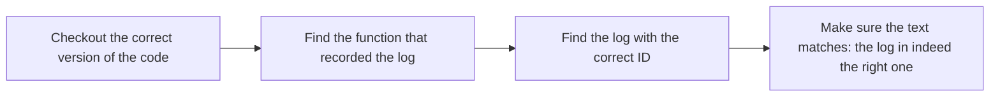
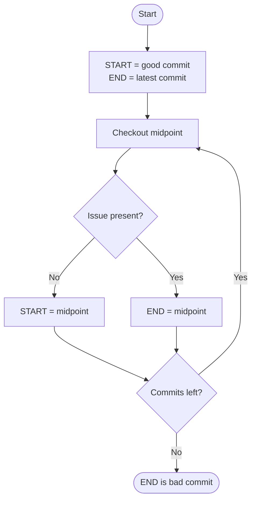

> :uk: **About this sample**  
This started as a collection of notes I wrote about the maintenance process of (mostly) legacy code: what is the workflow we are supposed to follow, what tools are available to us, how to analyse the data retrieved by Customer Support from the clients... I later organised the notes into this document so that it might help other, newer developers with their own maintenance process. This guide assumes some familiarity with our codebase and tools.  
**To avoid any potential issue with confidentiality, I changed the names of all Atempo-owned assets.**


> :fr: **À propos de cet exemple**  
Ce document est construit à partir d'une collection de notes que j'ai écrites sur le processus de maintenance du code legacy : quel est le processus à suivre, quels outils sont à notre disposition, comment analyser les données récupérées par le support auprès des clients... J'ai ensuite organisé les notes dans ce document afin qu'il puisse aider d'autres développeurs, moins expérimentés, dans leur propre processus de maintenance. Ce guide suppose une certaine familiarité avec notre base de code et nos outils.  
**Pour éviter tout problème de confidentialité, j'ai changé les noms de tous les éléments appartenant à Atempo.**


---

# Summary
- [1. Maintenance workflow](#1-Maintenance-workflow)
- [2. Analysis of available data](#2-Analysis-of-available-data)
	- [2.1 Environment Diagnostic Tool report analysis](#21-Environment-Diagnostic-Tool-report-analysis)
	- [2.2 Logs analysis](#22-Logs-analysis)
	- [2.3 Code analysis](#23-Code-analysis)
	- [2.4 Database analysis](#24-Database-analysis)
- [3. Checking the code history](#3-Checking-the-code-history)
- [4. Debugging](#4-Debugging)
	- [4.1 Standard debug and profiling tools](#41-Standard-debug-and-profiling-tools)
		- [4.1.1 GDB](#411-GDB)
		- [4.1.2 Valgrind](#412-Valgrind)
		- [4.1.3 Heaptrack](#413-Heaptrack)
		- [4.1.4 Debug integration in VSCode](#414-Debug-integration-in-VSCode)
	- [4.2 AtomXStore logStop mechanism](#42-AtomXStore-logStop-mechanism)
	- [4.3 Useful Linux commands](#43-Useful-Linux-commands)
		- [4.3.1 Checking the current call stack of a process with pstack](#431-Checking-the-current-call-stack-of-a-process-with-pstack)
		- [4.3.2 Displaying the mapped memory with pmap](#432-Displaying-the-mapped-memory-with-pmap)
		- [4.3.3 Checking files and database integrity with md5sum](#433-Checking-files-and-database-integrity-with-md5sum)
		- [4.3.4 Checking listening ports with netstat](#434-Checking-listening-ports-with-netstat)
		- [4.3.5 Checking running services with ps](#435-Checking-running-services-with-ps)
		- [4.3.6 Displaying environment variables with env](#436-Displaying-environment-variables-with-env)

# 1. Maintenance workflow
When Customer Support encounters or suspects a bug in AtomXStore, they will create a *Support Request* Jira ticket. The person in charge of dispatch will then assign the issue to the relevant developer depending on the type of issue (client/server/UI side).

The first step when troubleshooting an issue reported by Customer Support is to check whether the problem is already known:
- Search Jira for similar entries using keywords specific to your case (you might find the issue has already been fixed and is waiting to be patched).
- Search the AtomXStore Knowledge Base at knowledgebase.atomxstore.com/KB/Login.php to find similar issues (also useful to find potential workarounds).

If the issue is actually new, make sure that it is a real bug and not simply a configuration error that Customer Support might have overlooked. This mostly comes with experience, but some errors in the logs are a clear indicator (for example functions returning `ERR_CONFIGURATION`).

Then, you can go on to find and fix the root of the issue. After that, the usual process is:
1. Create a "Bug" type Jira ticket and link it to the Customer Support issue.
2. Reproduce the issue with clear, repeatable steps and write them down in the "Testing" section to help QA.
3. When the fix is ready, create a fix branch using the new Jira ticket name.
4. Test the fix by using the same method you reproduced the issue with.
5. Request to merge the fix branch into the master branch.
6. After the review is done, update the ticket to "In QA" status.
7. Update Customer Support to let them know a fix is coming (inform them as soon as possible of any workaround).
8. Keep an eye on your email: the DevOps team might request that you report the fix into an older version.

Finding the cause of the issue is usually the hardest and most time-consuming part. The rest of this document will help you do this in a more efficient way by introducing options to:
- Analyze the logs and data retrieved by Customer Support
- Analyze the client's database (when available)
- Analyze the source code and its history
- Debug the AtomXStore binaries


---


# 2. Analysis of available data
## 2.1 Environment Diagnostic Tool report analysis

The main source of data you can get from Customer Support is the report from the Environment Diagnostic Tool (EDT). This is an executable file that runs on the client's server and creates a directory containing all the possibly relevant information from the system: AtomXStore install directory, logs, configuration files, general system specs... It contains a huge amount of information, which is why it is essential to know what to look for.

The EDT report for any specific case can be found at `reports.atomxstore.com:/data/support/EDT/<case number>`. Inside this directory, the most useful information you will find is:
- The AtomXStore install directory `AtomXStore_install` that mostly contains AtomXStore logs.
- The AtomXStore configuration directory `AtomXStore_conf` that contains:
	- The client's AtomXStore parameters file `AtomXStore_parameters.xml`.
	- The detail of the client's configuration:
		- Storage information in `storage.txt`.
		- Current version and patch in `version.txt`.
		- The current licence file `licence.txt`.
		- Database information (version, size...) in `database_info.txt`.
- The system information directory `System_info`, which includes:
	- The AtomXStore version and update history in `System_info/AtomXStore/versions.txt`.
	- Potentially lost logs from AtomXStore in `System_info/AtomXStore/messages.txt` (when the logging system is defective, logs can end up here instead of the regular log files).

This is just a small part of all the available files, so do not hesitate to search for relevant keywords. These are however the ones that help most of the time.

## 2.2 Logs analysis

The AtomXStore logs are the main source of information for analysis and debugging. They are always constructed the same way:  
**`<PID> | <date> | <binary> | <log ID> | <function name> | <log text> | <server name> | <job id> |`**
- `PID` is the PID of the process that recorded that log.
- `date` is the exact time of the log, in Epoch format.
- `binary` is the name of the binary that recorded the log (for example atomxstore_launcher or atomxstore_daemon).
- `log ID` is the ID of the log inside the function `function name` that produced the log.
- `log text` is the full text of the log.
- `server_name` is the name of the server the process is running on.
- `job id` is, when available, the identifier of the current job.

Logs are written sequentially, but be careful: errors are escalated from the bottom-level functions to the top of the stack, which means in this case logs are added from the deepest calls to the most high-level ones, which can be counter-intuitive.

Reading logs can be difficult, especially when files are millions of lines long. To help with this, a tool to convert logs into XLS files is available at `AtomXStorestorage.atom.dev/storage/tools/log_converter.py`. Running this tool with the parameter `-file <log file>` outputs a more readable file with fully converted Epoch dates that can then easily be searched or filtered (by server or job for example). In case the log file is too big, the tool will output multiple XLS files.

Customer Support will usually point you towards specific errors in the logs that they (or the clients) think are related to the issue at hand. Those logs are not necessarily linked to the root cause of the issue, so always look for errors outside of this scope. 

If you suspect the issue is coming from a specific module and current logs are not enough to find out what happens, you can request Customer Support to add debug parameters for that module. They will ask the client to edit their configuration files, activating more debug logs that would otherwise be hidden. The full list of debug parameters is found in the AtomXStore sources at `Sources/conf/parameters_list.xml`.

## 2.3 Code analysis

Log files can inform you about the errors that were thrown as well as the exact order of functions calls in the stack. With that information, you can search the AtomXStore codebase to find exactly where these logs are coming from. Make sure the code version is the exact same as the client's binaries by checking the `version.txt` file in their EDT report.



Your knowledge of the codebase is what will allow you to understand what exactly happened and how to fix it. To help with this however, don't forget to ask more experienced developers.

Another possibility that is currently being experimented is the use of Cursor AI. You can add the EDT report directory to the current project (AtomXStore sources) to allow Cursor access to the entire report, allowing cross-referencing with the sources. You can then give it all the relevant information from Customer Support and ask for directions.

> :warning: Never blindly trust what Cursor says. AI can be a great tool for brainstorming ideas or finding something obvious you might have overlooked, but it can also very confidently give wrong answers.

## 2.4 Database analysis

Alongside logs, it is sometimes necessary to have direct access to the client's database. If the client agrees to send it to Customer Support, the compressed database will be available at `/data.atomxstore.dev/support_storage/db/<case ID>`. You can then copy it into your AtomXStore home directory. After decompressing the database with the `atom_restore -file <database file>` command, you have two options:
- Use the `atom_debug -database <database name>` command to interactively browse the database.
- Decode the database to plain text files with the `atom_decode -file <database file>` command (not recommended, but sometimes necessary).

Usage of the `atom_debug` binary is the subject of a complete guide on Confluence under the "Developer Tools" category. In short, it allows browsing the database objets in a similar way to a filesystem and gives a large number of tools for displaying, editing and fixing database objects.

> :warning: The size of a decompressed database can be as much as 10 times the compressed size, so make sure your environment has enough available space. Most of the time however, the database includes a large part of empty space which acts as a buffer to prevent performing too many expanding operations. This means the actual size of the database might be much less than it seems (the only way to know is by asking Customer Support). In that case, add the parameter `ignore_db_size=true` in your configuration file to cause the `atom_restore` command to ignore the database size restrictions.

---

# 3. Checking the code history

The Git version control is an invaluable tool to find the cause of issues encountered by clients. Many times, the issue appears soon after an update to a newer version (check `versions.txt` in the EDT report to see the update history). In that case, checking the Git history to find changes from the previous version can limit your search to code added in a shorter period of time.

If you don't exactly know when the issue started to appear but are able to (quickly) reproduce it, performing a dichotomy might help pinpoint the defective commit. To do this, first checkout an older commit that you think works properly. Then test it: if the issue is already there, checkout an older commit and test it again. Do this until you find one that works: that's your starting point. From this first commit:
1. Checkout the midpoint of your starting point and the most recent one.
2. Test it:
	- If it works, this is your new starting point (the issue appeared later).
	- If not, the issue appeared between this commit and your current starting point. Checkout the commit at the middle of both: this is your new starting point.
3. Go back to 1. with your new starting point.
Repeat this until you can pinpoint exactly which commit causes the error, which will limit the scope of your search. This is summarized in the diagram below:



Usually, after repeating this process a few times, you will end up with a limited number of commits among which only a few are relevant to the issue. You can then manually exclude some of them and keep only one or two for analysis, speeding up the process.

---

# 4. Debugging

Many tools are available for debugging running binaries or dumped cores. This section introduces some of the tools that are used by AtomXStore developers, but is very far from being exhaustive. You are of course encouraged to use anything you see fit, but don't forget to add a usage guide on Confluence for new tools!

## 4.1 Standard debug and profiling tools

### 4.1.1 GDB
GDB is a command-line debugger for C, C++, and other compiled languages. It lets you run binaries step-by-step, set breakpoints, inspect variables, examine memory, and analyze core dumps. A full guide to GDB usage is available on Confluence: [How to use GDB](dummy.tools.atomxstore.dev/guides/gdb).

### 4.1.2 Valgrind
Valgrind is a heap memory profiler that records memory allocations and helps analyze where and how memory is being allocated. It’s especially useful for understanding memory consumption and finding memory leaks. Its integration with AtomXStore binaries is somewhat tricky and requires modifying the configuration files. It cannot be attached to running AtomXStore binaries, which limits its range of application. See [Valgrind guide](dummy.tools.atomxstore.dev/guides/valgrind) for details.

### 4.1.3 Heaptrack
Heaptrack is used for dynamic analysis of processes. Its Memcheck function detects memory leaks and use of uninitialized memory at runtime. It is much easier to use with AtomXStore binaries than Valgrind as it can readily be attached to a running process. For a detailed usage guide, see the [Heaptrack](dummy.tools.atomxstore.dev/guides/heaptrack) Confluence page.

### 4.1.4 Debug integration in VSCode
For those using Visual Studio or Visual Studio Code, a debug module is available and will allow you to run the debugger of your choice with a graphical UI and set breakpoints directly in your source files. For more information, refer to the complete [Debugging with Visual Studio](dummy.tools.atomxstore.dev/guides/debug_with_visual_studio) guide.

## 4.2 AtomXStore logStop mechanism

The AtomXStore code include a special mechanism called "logStop" for debugging using the logging function calls as breakpoints. To use this feature, add the following parameters to your XML configuration file:

```
<parameter name="logStop_function"><value>  function  </value> </parameter>
<parameter name="logStop_functionID"><value> id </value> </parameter>
<parameter name="logStop_effect"><value>  effect  </value> </parameter>
```

Those parameters allow identifying specific log calls that will trigger the logStop mechanism, and describe what should be done when reaching one of those log calls.

- `function` is the name of the function in which the targeted log calls are located.
- `id` is the identifier of the log call inside that function (if multiple log calls have the same identifier in the same function, they will all successively trigger the logStop mechanism).
- `effect` describes what the logStop system should do when reaching a targeted log call. Options are:

|Option|Effect|
|:----:|----|
|`pause`|Pauses the process until a "kill" command is issued (this will instead resume the process).|
|`stop`|Completely shuts down the process, and escalates an error code through the stack.|
|`stack`|Dumps the current stack in the logs.|


## 4.3 Useful Linux commands
This section lists a number of simple commands that are especially useful for debugging AtomXStore issues. Each one is associated, if possible, to a typical use case. Again, this is just a tiny fraction of what is available, so feel free to experiment, research or use what you already know to expand this list.

### 4.3.1 Checking the current call stack of a process with pstack
`pstack` displays the current call of a running process. This is invaluable in cases where you suspect a deadlock issue, to check which processes are trying to take a lock. In cases where a process is running slow, you can loop the command as a quick profiling tool, to check which call appears more often and might be slowing things down.

### 4.3.2 Displaying the mapped memory with pmap
The command `pmap <PID>` displays a memory map of a running process. Although cases are rare, this can be useful to understand issues related to the memory mapping of the database (for example cases where too much memory is mapped).

### 4.3.3 Checking files and database integrity with md5sum
`md5sum <file path>` creates a MD5 hash of a file. Use this to check the integrity of high-volume files after a network transfer. In the Customer Support's repository of client data, each database is associated to a MD5 hash in a text file. By comparing the hash with the one you generated locally, you can make sure the database is still valid after a transfer.

### 4.3.4 Checking listening ports with netstat
The `netstat` command displays active connections and listening ports, along with the processes using them.
The following options are especially useful for troubleshooting networking issues between AtomXStore client and server:
- `-n` (numeric) display IP addresses instead of resolving hostnames, and port numbers instead of service names.
- `-a` (all) display all connections, active and inactive ones.
- `-p` (process) display the PID of processes.

### 4.3.5 Checking running services with ps
Process Status, `ps`, displays a list of running processes. Use options:
- `-a` to show all users.
- `-e` to show every process including background ones (specifically the AtomXStore daemon).
- `-f` to show detailed information.
Then pipe the output to a `grep atomxstore` to filter AtomXStore processes. This is your main way of monitoring these processes.

### 4.3.6 Displaying environment variables with env
The `env` command displays a full list of environment variables. This is useful for configuration issues, for instance when the AtomXStore install path is not found when starting a process. Again, use `grep` on the output to filter variables as needed.
