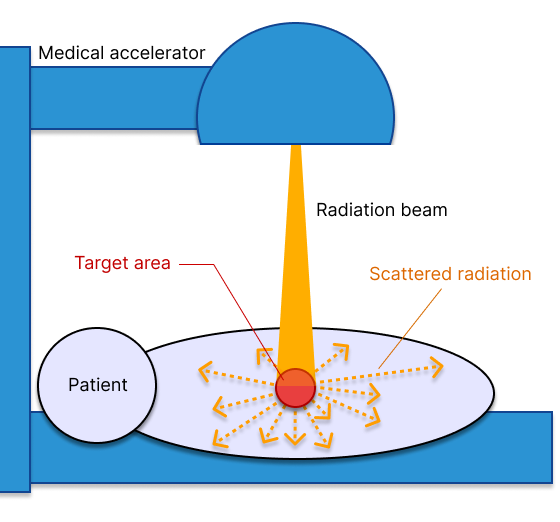
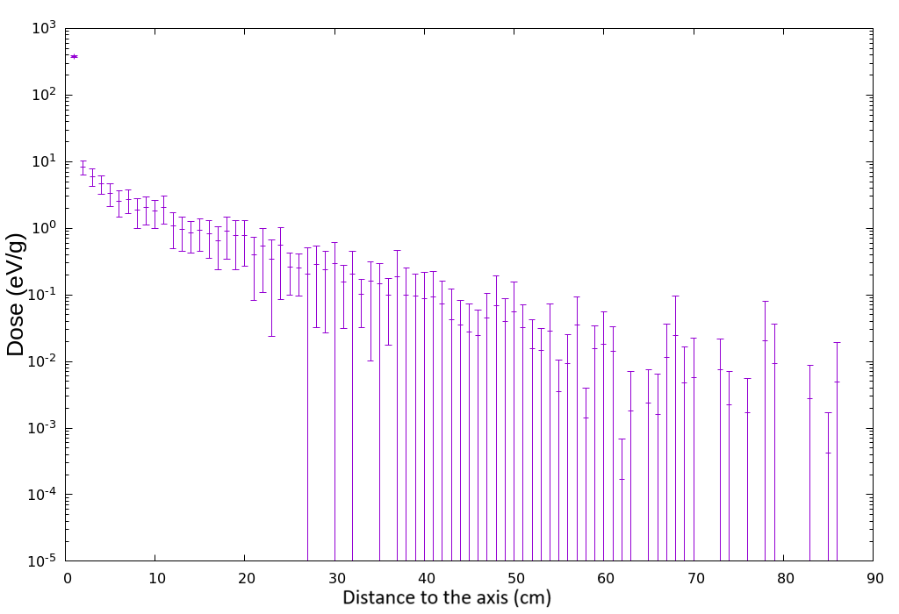
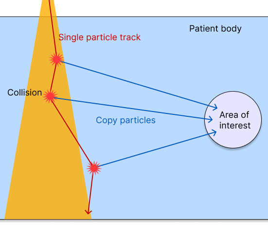
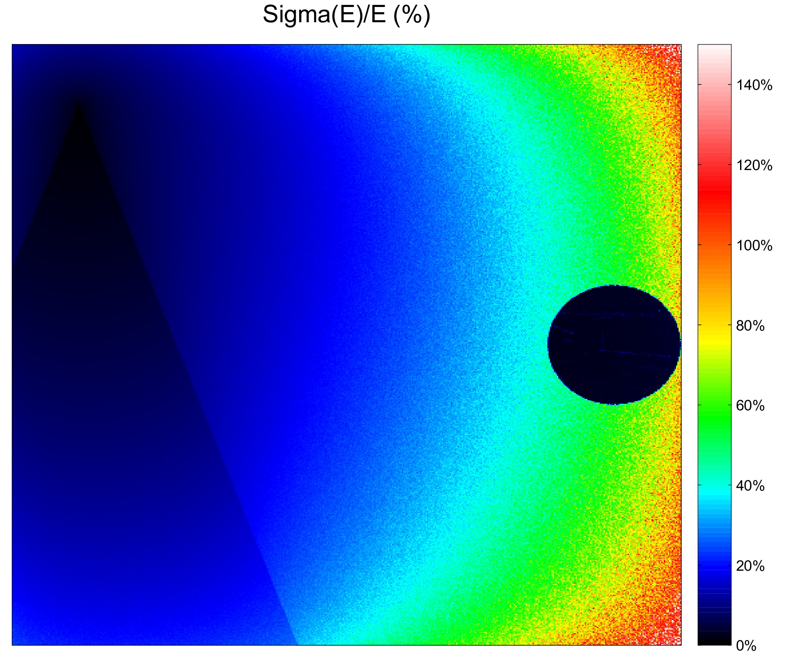
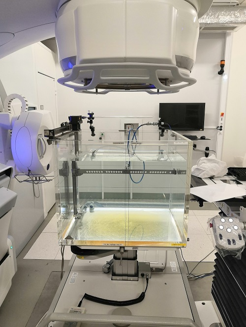

> :fr: **À propos de cet exemple**  
Ceci est un court résumé de mon travail de thèse préparé spécialement pour ce portfolio. Il est destiné à un public général sans connaissances préalables en physique.
J'ai ajouté le manuscrit complet au dépôt comme référence technique.

> :uk: **About this sample**  
This is a short summary of my PhD work made specifically for this portfolio. It is supposed to be targeting a general audience with no prior physics knowledge.
I added the full manuscript to the repository as a technical reference.

---

# Accelerating Medical Physics

## Introduction: the hidden side of radiotherapy
Radiotherapy is currently one of the pillars of cancer treatment. It uses high-energy radiation to destroy tumors while sparing healthy tissue. Although it has become extremely precise at targeting cancer cells, the laws of physics make it impossible to completely eliminate side effects.
Indeed, when radiation hits a patient, it does not stop at the tumor but instead spreads out. This creates what is called the peripheral dose: small amounts of radiation that reach healthy organs, sometimes far from the treated area.  
Although these doses are low, they are not without risk. It has been shown that this stray radiation is a likely cause of secondary cancers, appearing years or even decades after treatment. Current clinical tools are very good at calculating the dose inside the beam, but often ignore the peripheral dose because it is extremely demanding in terms of computing resources.

	 
	<em>A diagram showing a radiation beam targeting a tumor, and scattered particles reaching distant parts of the body.</em>

## Heavyweight simulations: the Monte Carlo problem
In medical physics, the gold standard for accuracy is a simulation technique called the Monte Carlo method. The principle is simple: a treatment is simulated by virtually creating billions of particles. They are then tracked in a computer model of the patient, recording every collision and every trajectory in order to calculate the radiation dose received. Of course, fewer particles are simulated than would be present in a real treatment, but statistics make it possible to obtain incredibly precise estimates nonetheless.

However, there is a fundamental problem: the laws of statistics dictate that the more particles reach a specific region, the more accurate the calculation is in that area. Since the peripheral dose comes from rare events (particles that scatter at very large angles and travel long distances), an astronomical number of particles must be simulated to obtain a statistically reliable result outside the beam. For a doctor who has to plan a treatment, waiting three days (or three weeks!) for a simulation is simply not an option.

	 
	<em>A graph showing the simulated radiation dose with regard to the distance from a vertical beam in a water tank. The uncertainty on the result (shown by the vertical bars on each data point) increases rapidly as the distance grows.</em>

One solution is to use simulation techniques called "variance reduction". The idea is to improve efficiency without sacrificing accuracy, even if it means bending the laws of physics a little.

## Deviating from pure physics: the pseudo-deterministic transport
My research focused on a specific variance reduction technique that we called pseudo-deterministic transport. With this algorithm, instead of waiting for a particle of the simulation to randomly bounce toward an organ of interest far from the beam (as they would do naturally), the technique consists in forcing a copy of that particle to go there after each collision, as if it had actually been scattered in that direction.

Obviously, artificially adding many more particles should give an overestimated result! To compensate for this departure from the laws of physics, we apply two rules:
 * The original particle is deleted as soon as it enters the region of interest.
 * The contribution of the copy to the final result is weighted by the probability it had of arriving there naturally.
That's all! These two conditions mathematically guarantee that the final result will be correct (I even had the opportunity to publish this demonstration in the journal Computer Physics Communications). Since many more particles reach the region of interest outside the beam, the accuracy of the result is greatly increased -or the duration decreased-.

	 
	<em>A diagram showing the trajectory of a particle with the pseudo-deterministic transport technique. At each collision, a copy is forcefully sent toward the region of interest.</em>

## From theory to practice: building the simulation module
To test the effectiveness of this new algorithm, I worked on Phoebe, a C++ Monte Carlo simulation code developed at CEA. The implementation required creating a new module to manage the tracking of these new particles and integrating it into the existing physics engine.
Once this step was completed, efficiency improved significantly. But that was not all: it turned out that using other variance reduction techniques at key moments in a particle’s life, in combination with the pseudo-deterministic transport, could further improve computational efficiency.

I therefore added an additional component to the simulation: the importance map. The idea is to divide the simulation area into a 3D grid in order to identify where the particles that naturally reach the region of interest come from. This creates a map that tells the software which areas of the patient’s body contribute the most to the peripheral dose. In addition to being informative, this map allows the simulation to stop tracking particles in low-contribution areas, thereby saving even more computing power.

## The last step: confronting reality
Our team validated the system in two stages. First, through numerical validations: we compared our results with massive and slow traditional simulations, to make sure no bias had been introduced. The results matched perfectly, but ours were obtained much more quickly.
We then carried out experimental validation. We set up real experiments using a real medical accelerator (which produces the radiation) and water tanks (which simulate human tissue) to compare our software’s predictions with actual physical measurements.

	
	 
	<em>A graph showing the uncertainty on the dose result for a simulation of a radiation beam in a water tank (second image). The uncertainty increases rapidly with the distance because fewer particles reach these regions. Inside the region of interest (the sphere on the right), the result is extremely precise and the uncertainty is close to 0%.</em>

## Conclusion: faster calculations for a better protection
The ultimate goal of this work was to provide a proof of concept for the clinical use of the pseudo-deterministic transport. Making peripheral dose calculations fast enough for daily use could help doctors choose treatment plans that minimize the risk of secondary cancers, and thus make radiotherapy safer in the long run. It could also allow gathering peripheral dose data, ignored by conventional treatment planning systems, which could improve our currently limited knowledge of the effects of low radiation doses.
