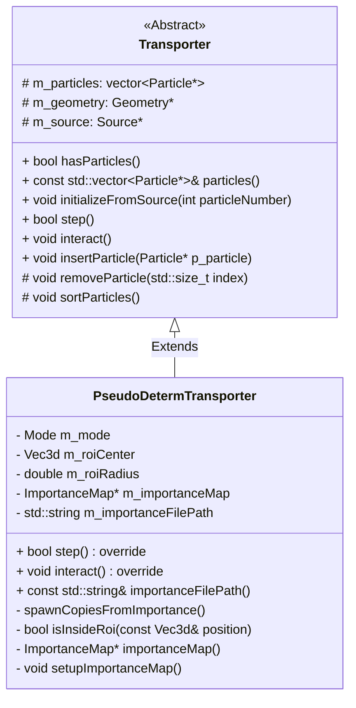
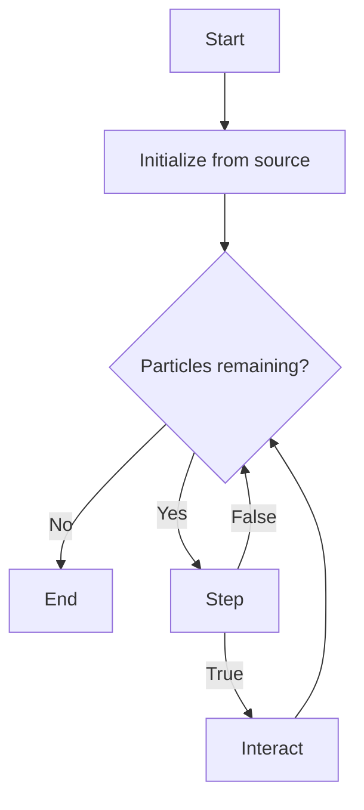

> [!IMPORTANT]
> :uk: **About this sample**  
This document is a reference for classes created for this portfolio, based on my PhD research work, and designed to perform a Monte Carlo simulation in radiotherapy.
The header files are available in the `Headers` folder and contain their own [documentation in Doxygen format](https://compiledphysics.github.io/CompiledPhysics/).

> [!IMPORTANT]
> :fr: **À propos de cet exemple**  
Ce document est une référence pour des classes fictives créées pour ce portfolio, basées sur mon travail de thèse, et conçues pour être utilisées pour réaliser une simulation Monte Carlo en radiothérapie.
Les headers sont disponibles dans le dossier `Headers` et contiennent leur propre [documentation au format Doxygen](https://compiledphysics.github.io/CompiledPhysics/).


# **Summary:** 
- [Introduction and class diagram](#Introduction-and-class-diagram)
- [Transporter class](#Transporter-class)
    - [Basic principle](#Basic-principle)
    - [Class introduction](#Class-introduction)
    - [Constructor & Destructor](#Constructor-&-Destructor)
    - [Basic accessors](#Basic-accessors)
        - [particles](#particles)
    - [Simulation methods](#Simulation-methods)
        - [initializeFromSource](#initializeFromSource)
        - [hasParticles](#hasParticles)
        - [step](#step)
        - [interact](#interact)
        - [insertParticle](#insertParticle)
    - [Typical simulation workflow](#Typical-simulation-workflow)
- [PseudoDetermTransporter class](#PseudoDetermTransporter-class)
    - [Basic principle](#Basic-principle)
    - [Class introduction](#Class-introduction)
    - [Constructor & Destructor](#Constructor-&-Destructor)
    - [Accessors](#Accessors)
        - [mode](#mode)
        - [importanceFilePath](#importanceFilePath)
    - [Simulation methods](#Simulation-methods)
        - [interact](#interact)
    - [Usage example](#Usage-example)


# Introduction and class diagram

This document describes the `Transporter` base class and one of its derived classes `PseudoDetermTransporter`. This inheritance can be represented by the following diagram:




# Transporter class
## Basic principle
The `Transporter` class is designed to be used for dose calculations in Monte Carlo simulations. It handles the transport of particles, which can usually be represented by a loop:
- The particle moves through matter, crossing a random distance that depends on local material properties.
- The particle interacts with its environment, loses some of its energy and potentially creates more particles.

Repeating this loop until the particle is absorbed by its environment (i.e. its energy is too low to keep going) simulates what is called a particle track. Repeating many particle tracks to collect statistical data about deposited energy is the basis for Monte Carlo simulation applied to radiotherapy.

## Class introduction
The `Transporter` is a pure virtual class that provides the basic tools to apply the transport algorithm to particles and simulate particle tracks. This base class is designed to be derived into more specific transport algorithms that implement their own movement and interaction models, but still implements the basic form of particle transport in its methods (to be called by derived classes as needed).
The class uses three data members:
- a `Source` object that initializes the particles to be transported.
- a `Geometry` object that contains all the geometrical and physical data of the simulation environment, as well as deposited energy information.
- an internal list of `Particle` pointers (stored in a `std::vector<Particle*>`).

Both the `Source` and `Geometry` are external to the `Transporter`: they have to be created first, and destroyed only after the `Transporter`, which does not own them but only stores pointers to them.
The list of particles, however, is fully internal to the class and is freed when the `Transporter` is destroyed. The list is sorted from lowest to highest energy, which allows simulating first the `Particles` with the shortest tracks (as they may be absorbed faster), thus keeping the internal list as short as possible for memory optimization.

The main methods for particle transport are the following:
|Name|Purpose|
|---|---|
|`step`|Handles the particle movement|
|`interact`|Handles the particle interactions|

Both of those can be overridden with various transport algorithms and physical models. The class also includes helper methods to allow monitoring of the internal `Particle` list.

## Constructor & Destructor
The `Transporter`'s only constructor uses the following prototype:

`Transporter(Source*, Geometry*)`

The `Source` and `Geometry` must be allocated and initialized before the `Transporter` is constructed. Both are tested for pointer validity (giving `nullptr` for any of them will result in throwing `std::invalid_argument`), but cannot be tested for functional validity.
The user is responsible for correctly initializing these objects.

Once constructed, the `Transporter` does not take ownership of the `Source` and `Geometry` so these **must** remain valid until the `Transporter` is destroyed. The destructor destroys all particles inside the internal list, regardless of the way they were added (from the `Source`, the `interact` method or externally through `insertParticle`).

## Basic accessors
### particles
The `Particle` list can be accessed with a constant reference to the internal vector:

`const std::vector<Particle*>& particles() const noexcept`

This can be used to monitor the state of the particle list and access any individual `Particle`, but does not allow adding or deleting particles. For this, use `insertParticle(Particle*)` instead.

## Simulation methods
### initializeFromSource

`virtual void initializeFromSource(int particleNumber)`

This method is used to add to the internal list the requested number `particleNumber` of particles created from the `Source`. It is recommended to create batches of many particles rather than adding them one by one, as the method will be able to reserve the vector memory only once to improve performance.

### hasParticles
`bool hasParticles()` returns `true` if the list of particles contains at least one element, `false` otherwise. It can be used as a condition for stopping a transport loop or re-generating particles from the `Source`.

### step
The `bool step()` method moves the current `Particle` (the first of the list) in its current direction. The distance is random and is sampled depending on the physical characteristics of the environment at the current position (defined by the `Geometry`).

This only modifies the position of a particle, but does not add deposited energy to the `Geometry` data. This method will delete the particle if it goes outside the boundaries of the simulation and return `false` in that case (`true` otherwise).

### interact
The `void interact()` method performs an interaction between the current `Particle` and the environment. First, the type of interaction is randomly determined according to the material properties of the current position through the `Geometry`. Then, the interaction is simulated and the particle may:
- Change direction
- Lose energy
- Disappear (particles under a certain energy threshold are considered irrelevant and are deleted after an interaction)
- Generate any number of new particles, of different types, that are added to the internal list

`interact` immediately deletes the current particle if it is located outside the geometrical boundaries.


### insertParticle
`void insertParticle(Particle*)` adds a single `Particle` to the internal list. It can be used for testing purposes or specific algorithms, but for general purposes please note that `initializeFromSource` is much more efficient.

Giving a null pointer to `insertParticle` has no effect.

> [!CAUTION]
>  The `Transporter` takes ownership of any `Particle` added through this method. It may delete them after a step or an interaction and it destroys all remaining particles in its destructor.

## Typical simulation workflow
The methods of the `Transporter` are designed to provide the tools for simulating particle tracks. A typical simulation workflow is represented below:




# PseudoDetermTransporter class
## Basic principle
The `PseudoDetermTransporter` class applies the pseudo-deterministic transport rules to particle transport in addition to the regular physical models. This algorithm is designed to increase the calculation efficiency in areas that only few particles reach, causing the statistical uncertainty to be high. It is based on the definition of a spherical area of interest that should surround the low-population area. Then, at every interaction that a particle undergoes:
- The original particle is copied, and copies are sent directly to the region of interest.
- Any contribution made by these copies is weighted by the probability of them actually being scattered in that direction and reaching the area of interest.
- The original particle is deleted without further contribution to the deposited energy if it enters the region of interest.

Strictly enforcing these conditions ensures that the deposited energy result inside and outside the region of interest is unbiased. The difference from regular particle transport is that many more particles reach the area of interest, thus significantly reducing the statistical uncertainty on the result for a similar simulation time.

Additionally, the `PseudoDetermTransporter` uses an importance map mechanism. The importance map contains information about which regions of space contribute the most to the number of particles inside the region of interest. Creating more copies in these regions is a good way to improve the efficiency, as copies created there will most likely have an important weight (as they were likely to reach the area of interest) and therefore are worth following. Conversely, particles creates in low-contribution areas can be deleted to save computation time. The map is used to determine which action to take to improve the simulation efficiency:

|Local map property|Action|Effect|
|-|-|-|
|High contribution area|Create more copies|Increase the efficiency per simulated particle|
|Normal contribution area|None|Do not lose time creating copies|
|Low contribution area|Potentially delete the current particle|Save computing time for irrelevant particles|

## Class introduction
The `PseudoDetermTransporter` class is a specific derivation of the `Transporter` class with overridden `step` and `interact` methods. It is designed to preserve the workflow of the base `Transporter` class, so that it can replace it with no changes to a pre-existing transport algorithm.

In addition to the base class, it uses an internal `ImportanceMap` pointer (allocated at creation). Its specific accessors allow retrieving the path of the importance map file and the `mode` in which it is operating:
- the *Generation* mode creates the importance map, initializes it with null values, fills it as tracks are simulated, and saves it to a file.
- the *Usage* mode loads an importance map from a file and uses it to optimize the efficiency.

## Constructor & Destructor
The constructor uses the same `Source` and `Geometry` as the base class, but has additional parameters regarding the region of interest and importance map:
```
PseudoDetermTransporter(Source*            source,
                        Geometry*          geometry,
                        Mode               mode,
                        const Vec3d&       roiCenter,
                        double             roiRadius,
                        const std::string& importanceFile);
```
`mode` is the simulation mode, either `PseudoDetermTransporter::Mode::Generation` or `PseudoDetermTransporter::Mode::Usage`.  
> [!NOTE]
> Using an invalid mode will default in `Usage` mode.

`roiCenter` is the center of the spherical region of interest (coordinates in cm from the geometry reference).  
`roiRadius` is the radius of the region of interest (in cm).

`importanceFile` is the path to the importance map file (to either load or save the map depending on the mode).
> [!NOTE]
> If no map can be loaded in `Usage` mode, the importance mechanism is disabled.

Because the `Generation` mode is slow and the importance map doesn't need much data to be effective, it is recommended to first generate an importance map with a short run, and then use it for the actual simulation that needs to be optimized.

> [!CAUTION]
> **One** importance map corresponds to **one** region of interest (it defines which regions of space contribute to *this* area in particular) and may decrease efficiency if used improperly. Therefore, in `Usage` mode, the constructor checks the consistency between the current area of interest and the one used to generate the map (stored in the file). If they do not match, the constructor throws `std::invalid_argument`.

## Accessors
### mode
The `Mode mode() const noexcept` accessor returns one of the two values of the pseudo-deterministic transport mode:
- `PseudoDetermTransporter::Mode::Usage`
- `PseudoDetermTransporter::Mode::Generation`

### importanceFilePath
`const std::string& importanceFilePath() const noexcept` returns a read-only path to the importance map file.

## Simulation methods

### step
In addition to the base class behaviour (deleting the particle and returning `false` if it goes out of bounds), for the `PseudoDetermTransporter`, the `step` method is responsible for preventing copied particles from entering the region of interest. It starts by checking whether the current particle has the `isCopied == true` flag. If it does and is located inside the region of interest after moving, it is deleted and the function returns `false`.
|Particle state after moving|Behaviour|Return value|
|-|-|-|
|Out of geometrical boundaries|Delete particle|`false`|
|Inside geometrical boundaries| - |`true`|
|Inside ROI + has isCopied flag|Delete particle|`false`|

### interact
The overridden `void interact()` method implements most of the pseudo-deterministic transport algorithm.

It performs an interaction as the base `Transporter` does, with additional elements:
- It evaluates the local importance from the `ImportanceMap`.
- It creates any number of additional weighted copies of the current particle, depending on the local importance value.
- It places them inside the area of interest.
- It sets the `isCopied()` flag to `true` for the original particle.
- Depending on the local importance, it might delete the current particle and return immediately.

> [!WARNING]
> Although it is limited to 1000 per interaction, this implementation may create a very large number of new particles over time. It increases the overall efficiency, but might increase the time required per initial particle generated (and use a lot of memory during a run).


## Usage example
This is a minimal example of the use of the `PseudoDetermTransporter` for a Monte Carlo simulation.

```
#include "PseudoDetermTransporter.hpp"

int main()
{
    // 1. Create simulation parameters (Source, Geometry, ImportanceMap)
    Geometry geometry; // assuming correct initialization
    Source   source;   // assuming correct initialization

    // Define a spherical region of interest
    Vec3d  roiCenter{0.0, 0.0, 0.0}; // position 0, 0, 0 cm from the point of reference
    double roiRadius = 10.0;        // Radius 10 cm

    // Importance map file used for generation or usage
    std::string importanceFile = "importance_map.dat";

    // 2. Create the pseudo-deterministic transporter with Usage mode for the importance map
    PseudoDetermTransporter transporter(
        &source,
        &geometry,
        PseudoDetermTransporter::Mode::Usage,
        roiCenter,
        roiRadius,
        importanceFile
    );

    // How many particles the simulation will track
    int particleNumber = 1000000;

    // Initialize particle list with the requested number of particles from the source
    transporter.initializeFromSource(particleNumber);

    // 3. Main transport loop: step + interact until no particles remain
    while (transporter.hasParticles())
    {
        // Step: move the current particle
        if (!transporter.step())
        {
            continue; // particle was deleted
        }

        // Perform interaction with pseudo-deterministic transport rules
        transporter.interact();
    }

    // At this point:
    // - geometry contains deposited energy information and is ready for analysis.
    // - The Transporter destructor will delete any remaining particles.
    // - source and geometry are destroyed on exit.

    return 0;
}
```
